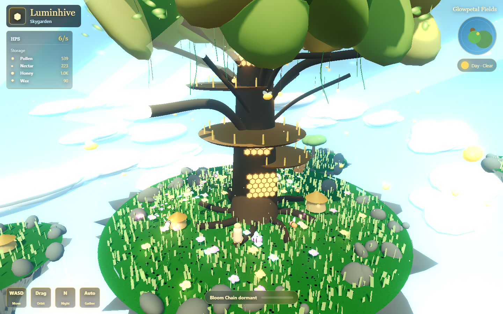

# Luminhive Skygarden

A small browser game in Three.js. You walk around a floating island with a giant hive tree while little glowing creatures called Lumens fly between flowers, collect pollen and bring it home. Pollen and nectar turn into honey and wax over time.



Everything on screen is built in code: the island, the tree and its platforms, waterfalls, flowers, huts, clouds and the Lumens themselves. There are no model files yet, which kept it quick to iterate on and means it loads instantly.

## Playing

| Key | Action |
| --- | --- |
| `W` `A` `S` `D` or arrows | move |
| drag | orbit the camera |
| `N` | switch between day and night |

Every so often one Lumen starts pulsing. Walk into it to start a **Bloom Chain**: each extra Lumen you reach within five seconds resets the timer and raises the pollen multiplier. Catch all of them for a 20 second boost, or let the timer run out for a shorter one.

Flowers never die. Each harvest drains them one step (full bloom, fading, drained, exhausted) and they recover a step every 2.5 seconds, so Lumens spread out across the island instead of stripping one patch. The numbers are in [docs/gameplay-spec.md](docs/gameplay-spec.md).

## Running it

```bash
npm ci
npm run dev
```

Open http://127.0.0.1:5173. `npm run build` type-checks and produces a static build in `dist/`.

## What's next

The procedural tree, player, huts and Lumens are placeholders for proper GLB models. The game logic and island layout are kept separate from the meshes so they can be swapped without touching the simulation. See [docs/engine-path.md](docs/engine-path.md) and [docs/vertical-slice.md](docs/vertical-slice.md) for where it's heading.

Built with TypeScript, Three.js and Vite.
